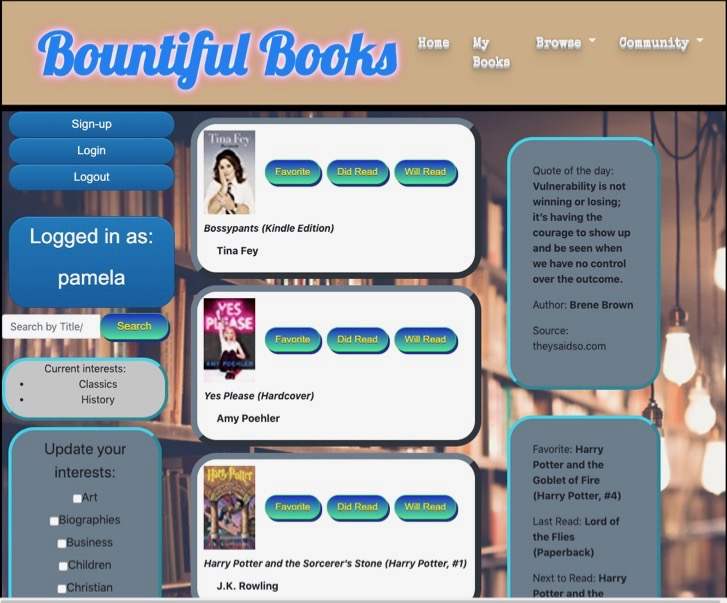

# Bountiful Books
Coding Boot-camp Group Project #1

### Deployed via Git Hub Pages:
https://robertalanis.github.io/Project-1/

### Team Members:
Scott Bayreder
Robert Alanis
Steven Bowler
Pamela Christian

##### Description
Bountiful books is an app designed to help users search and find book recommendations based on their interests or a keyword search

##### Motivation
As book lovers, we wanted an easy way to look up book recommendations based on an interest topic or a keyword search.  

We also wanted the application to save user preferences and load the page with recommendations aligned with those preferences as soon as they logged in to make it easy to find their next book to read.  As a final user benefit, we wanted the ability to save book recommendations to a “bookshelf” for future reference

##### Result

Built an application that:
* Protects user data with email/password authentication
* Saves user interest preferences and favorite book titles to a user “bookshelf” in the Firebase Database
* Allows the user to search for books based on title, author, or keyword and displays five books at a time in the center of the page with the ability to save book titles to the bookshelf
* Incorporate data from two separate websites via API calls

##### Technology Used:

* GoodReads API
* Quotes Rest API
* Firebase Database and Authentication
* HTML/CS/Bootstrap
* Javascript/jQuery
* JSON/XML

##### Individual  Responsibilities

* Scott - Front-end HTML Framework and CSS Styling
* Pamela — Back-End: Firebase database setup, Firebase Authentication and login, Preferences functionality, final integrations of back-end
* Robert — Back-End: GoodReads API, main search feature
* Steven — Back-End: Quotes API, Bookshelf functionality + ‘favorites’ buttons, GoodReads API by topics (on page load) 

##### Challenges

* The GoodReads API did not have the functionality we were planning to use it for so we had to change strategies slightly to meet the original intent of the application
* GoodReads API returned an XML data structure which we were not initially familiar with
* With user login, needing an additional field besides email to add information to the database (needed to capture that additional data on login)

##### Future Developments 

* Display a list of books based  on  preferences  when page  first loads
* Create links for interest  topics that return book recommendations for that  specific topic
* Make images/title/author links clickable to relevant pages
* Allow for multiple inputs to the bookshelf feature
* Email verification on sign-up
* Expand to other forms of authentication (i.e. Google)
* Setup the connect links (link to profile pages, contact, etc)

